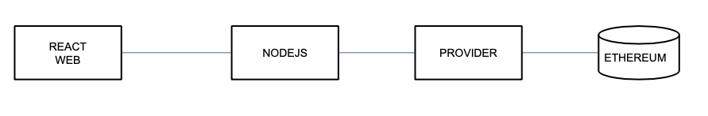

# 👾 BlockchainExplorer

<div id="header" align="center">
  <figure><figcaption></figcaption></figure>
</div>

<div id="badges" align="center">
  <a href="https://medium.com/@techieesp">
    
  </a>
  <a href="https://www.linkedin.com/in/jackybarraza/">
    
  </a>
  <a href="https://twitter.com/TechieESP_">
    
  </a>

</div>

## Overview

This project is a part of the curriculum for the "FromWeb2toWeb3 Blockchain Eng. Master" course offered by [CodeCrypto Academy](https://codecrypto.academy/).

This repository contains instructions and code for setting up a basic Ethereum Explorer using the Api from Infura.&#x20;

## Objectives

1. Explore the **Ethereum blockchain**.
2. Learn how to use an **external provider**.
3. Use the **Web3 API** to access information.
4. Utilize a **React application** for interaction.
5. Develop a **Node.js API that communicates with the provider**.
6. Request the following information from the provider:
   1. Block details with its transactions.
   2. Information about a specific transaction.
   3. Account balance.

## Process Overview

From a form created in React, we will access a Node.js API that connects to an Ethereum provider.\


<figure><figcaption><p>by <a href="https://github.com/Jviejo">jviejo</a> from codecripto</p></figcaption></figure>

***

## Backend: **Ethereum Node Information Service**

The Ethereum Node Information Service is a straightforward Node.js application that provides data related to the Ethereum blockchain using the Web3 library. It offers several routes for retrieving information about Ethereum blocks, transactions, and account balances.

#### **Prerequisites**

Before running the application, ensure that the following prerequisites are met:

1. **Node.js:** Download and install Node.js.

#### **Installation**

To set up the application, follow these steps:

1.  Clone this repository to your local machine:

    ```shell
    git clone https://github.com/yourusername/ethereum-node-info-service.git
    ```
2.  Navigate to the project directory:

    ```shell
    cd backend
    ```
3.  Install project dependencies:

    ```shell
    npm install
    ```

#### **Configuration**

To configure the Ethereum node URL and server port, you need to set up environment variables. Create a `.env` file in the project directory and add the following content:

```shell
codePORT=2525               # The port on which the server will listen
URL_INFURA=<your_infura_ethereum_node_url>   # Infura Ethereum node URL
```

Replace `<your_infura_ethereum_node_url>` with your Infura Ethereum node URL.

**Usage**

Start the application with the following command:

```shell
npm start
```

or

```bash
npx nodemon index.js
```


The server will launch, allowing you to access the following routes:

* `/ping`: Check if the server is running.
* \`/: Get the current block number.
* `/block/:block`: Retrieve information about a specific block using its block hash or block number.
* `/tx/:tx`: Obtain details about a specific transaction using its transaction hash.
* `/balance/:address`: Retrieve the balance of an Ethereum address.

###

***

## Frontend: **Ethereum Explorer Frontend**

This repository contains the frontend code for an Ethereum Explorer application. This application allows users to explore Ethereum blockchain data by providing various functionalities to search for blocks, transactions, and account balances.


### Functionalities

#### **Main Code**

The main code initializes the React application and sets up the routing for different views. It uses React Router to navigate between different components based on user interactions. Additionally, it uses the React Query library for data fetching and management.

#### **Home Component**

The Home component serves as the landing page of the Ethereum Explorer application. Users can input Ethereum block numbers, transaction hashes, or addresses to search for specific information. The component also displays the current Ethereum block number. The Home component is responsible for:

* Handling user input and navigation based on the input data.
* Displaying the current Ethereum block number obtained from the backend.
* Providing a "Home" button to return to the main page.
* Offering a "Go Back" button for navigation.

#### **Block Component**

The Block component displays information about a specific Ethereum block. It fetches and presents the block's details, including transactions, using the React Query library. The component is responsible for:

* Retrieving and rendering block information.
* Displaying a list of transaction hashes with links to individual transaction pages. (work in progress)
* Handling loading and error states with loading indicators and error messages.

#### **Balance Component**

The Balance component is responsible for displaying the balance information of a specific Ethereum account. The component utilizes React Router for routing and React Query for data fetching and management.

The Balance component performs the following functions:

1. Fetches and displays the balance of the Ethereum account specified in the URL parameters.
2. Handles loading and error states with loading indicators and error messages.
3. Presents the account balance in a visually appealing format using the React-JSON-Pretty library.

#### **Transaction Component**

The Transaction (Tx) component is  is responsible for displaying detailed information about a specific Ethereum transaction. The component uses React Router for routing, React Query for data fetching and management, and React-JSON-Pretty for presenting JSON data.

The Transaction component performs the following functions:

1. Fetches and displays detailed information about a specific Ethereum transaction specified in the URL parameters.
2. Handles loading and error states with loading indicators and error messages.
3. Presents transaction details, including block number, sender (from), recipient (to), and transaction value.
4. Provides links to navigate to the corresponding block and account balance pages for further exploration.

### **Dependencies**

This frontend code relies on the following libraries and tools:

* React: The JavaScript library for building user interfaces.
* React Router: A library for handling routing in React applications.
* React Query: A data fetching and state management library.
* React Hook Form: A library for managing form state in React.
* React-JSON-Pretty: A library for displaying JSON data in a visually appealing format.
* CSS: Styling is applied through CSS stylesheets.

### **Getting Started**

To run this frontend code locally, follow these steps:

1. Clone the repository to your local machine.
2. Navigate to the project directory `frontend` using your terminal.
3. Install project dependencies using&#x20;

```bash
npm install
```

4. Ensure that the backend server (API) is running and accessible. [Check Backend section.](./#configuration)
5. Start the frontend application with the following command:

```shell
npm start
```

or

```bash
npm run dev
```


The application should start locally, and you can access it through your web browser.

Explore Ethereum blockchain data and enjoy using the Ethereum Explorer frontend!


